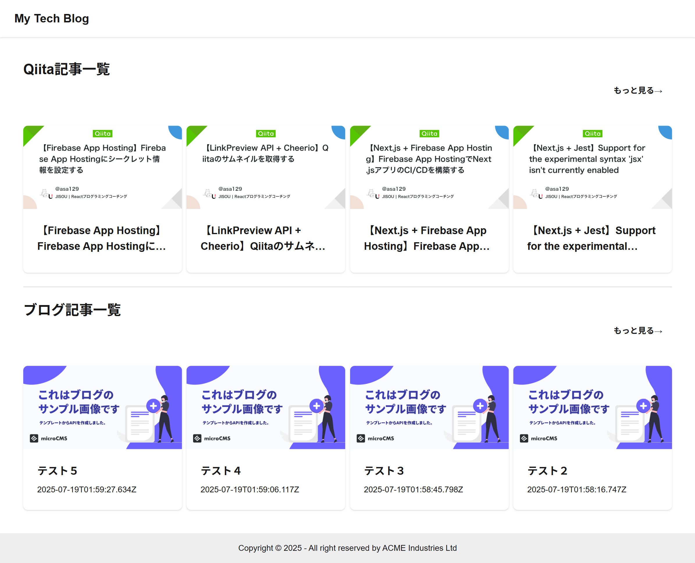

# Tech Blog

## 技術ブログ

Tech Blog

## 機能概要

- **Qiita 記事一覧**：自分がこれまでに投稿した Qiita 記事を一覧で表示できます
- **MicroCMS 記事一覧**：自分がこれまでに投稿した MicroCMS 記事を一覧で表示できます

## スクリーンショット



## 使用技術


## 必要環境

- Node.js v20.19.0 以上
- npm

## セットアップ

### 1.リポジトリをクローン

```bash
$ git clone https://github.com/asa129/tech-blog
$ cd tech-blog
```


### 2.パッケージインストール

```bash
$ npm install
```


### 3.環境変数を設定

必要な API キー、アクセストークン、URL

- Qiita：
https://qiita.com/api/v2/docs
- MicroCMS：
https://microcms.io/
- LINKPREVIEW：
https://my.linkpreview.net/

`.env.example`を`.env`に変更して、以下を設定してください

```bash
QIITA_API_TOKEN=your_qiita_api_token
X_MICROCMS_API_KEY=your_microcms_api_key
LINKPREVIEW_API_KEY=your_linkpreview_api_key
```

### 4.開発サーバー起動

```bash
npm run dev
```

### 5.ブラウザで URL にアクセス
http://localhost:3000
